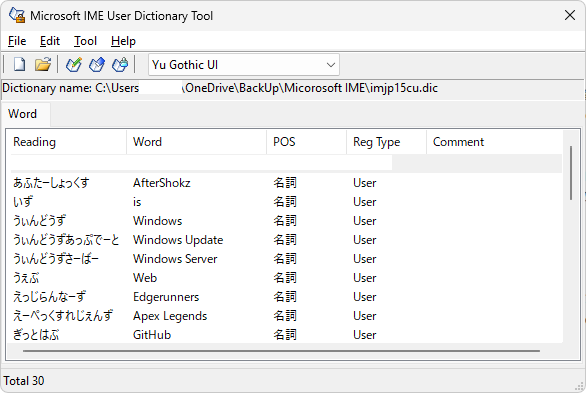

ニーズ:IMEの辞書で場所を指定したい。
→例えば、OneDriveにIMEのユーザー辞書を置いておくことで、複数のPCで同じユーザー辞書を使用することができるようになる。

下記のように、開いている場所は見えるが、これを変更しようとすると少し手間がかかる。
File>Openなどで、別の場所のファイルを開くことはできるが、それがデフォルトのファイルになるわけではない。
またIMEを開くと、デフォルトで登録されているユーザー辞書の場所を見に行っている。



しかし、下記のコマンドを実行することで、デフォルトのユーザー辞書の場所を変更することが可能。
例えば、OneDrive上に辞書を置いて、そのpathを指定することで、複数のWindows OSで同じ辞書を使用、編集することが可能になる。
マジで便利機能かもしれない。

```bash
%SystemRoot%\System32\IME\IMEJP\imjpuexc.exe setcustomdictpath "新しいユーザー辞書の場所\imjp15cu.dic"
```

ただし、辞書の名前を「imjp15cu.dic」にしているので、ここと、新しい辞書の場所については、ご自身で設定を確認の上、値を入れてほしい。

以上だが、非常に便利なので、ぜひ使ってみてほしい。