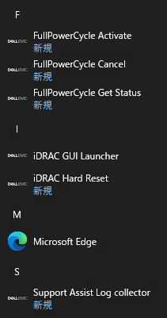
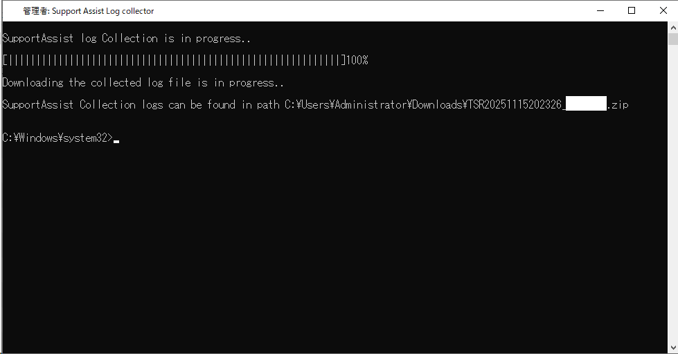

## 軽量なOS上で動作するAgent。
iDRAC Service Module(iSM)は、Dell PowerEdge向けに開発された、ホストOS向けツールです。
PowerEdgeユーザーの皆様ならお分かりになられるかとは思いますが、例えば、PowerEdgeのログを採取する際に、いちいちホストOSが搭載されているサーバー機のiDRACに接続してそこからログを取得する…という流れは煩雑に思えます。OSが上がっているなら、そこからTSRログが取れればよいのに、という状況で活躍するのが、このツールとなります。

[Dell iDRAC Service Moduleのサポート - Dell 日本](https://www.dell.com/support/kbdoc/ja-jp/000178050/)

## 機能
iSMの説明を見ると、何が何だかよくわかりません。インストールすると、何が起こるのか見ていきましょう。

>iSMはOS関連の情報をiDRACに提供するとともに、さまざまな機能を追加します。たとえば、OSログへのLifecycle Controllerログ イベントのレプリケーション、OSを介したiDRAC SNMPアラート、オペレーティング システムからiDRACテレメトリーへのメトリック インジェクション、iDRACハード リセット、リモート フル パワー サイクルなどです。

[Dell EMC iDRAC Service Module（Windows用）、v5.4.1.1 - ドライバの詳細 - Dell 日本](https://www.dell.com/support/home/ja-jp/drivers/driversdetails?driverid=gc9th)

## インストール/iDRACへのアクセス
インストール方法は非常に簡単です。各サーバー機のサポートページからダウンロードしたファイルをインストールし、iDRACへアクセスするまでの手順がDell Technologies公式の記事に記載されています。インストールにあたって、ホストOSの再起動は不要となります。

[PowerEdge：iSMをインストールしてiDRAC UIランチャーを起動する方法 - Dell 日本](https://www.dell.com/support/kbdoc/ja-jp/000194572/)

iSMをインストールしたのに、iDRAC GUI Launcherが使用できない場合には、iDRACの「OSからiDRACへのパススルー」の設定において、パススルーモードが「USB」に設定されていることを確認ください。

デフォルトでは、iDRACはOSとの通信(パススルー接続)に仮想USB NICを使用するように設定されています。例えば、Windows ServerではiSMがインストールされているかどうかにかかわらず、「Remote NDIS Compatible Device」というUSB NICとして追加されます。iDRACは、この仮想USB NICを使用して、OSと通信します。

[iDRAC：iDRACサービス モジュールの設定とトラブルシューティング - Dell 日本](https://www.dell.com/support/kbdoc/ja-jp/000188051/)

OS上からiDRACへアクセスすることができれば、おそらくほとんど困ることはないと思います。iDRACは帯域外管理向けのソリューションではありますが、iSMを経由してホスト上にインストールされているOSからアクセスすることでその恩恵を大いに受けることができます。

## SupportAssist Log Collector
iSMをインストールすると、いくつかのモジュールがインストールされます。



その中でも、SupportAssist Log Collectorは、実行するだけでTSRログを採取できる、非常に便利なツールです。\
※第14世代以降のPowerEdgeでしか機能しないようです。手元のPowerEdge T430(第13世代PowerEdge)では、「Unable to run the command because the SupportAssist Collection feature is not supported on systems earlier than 14th generation.」というメッセージが表示され、実行できませんでした。このような場合は、おとなしくiDRAC GUI Launcherを使用しましょう。

SupportAssist Log Collectorを実行するには、iSMをインストールした際に出てくる「Support Assist Log collector」のアイコンをダブルクリックします。



すると、自動的にTSRログを採取してくれます。採取されたTSRは画像のように、デフォルトではDowonloadフォルダに格納されます。

<details><summary>実行時の表示</summary>

```bash
SupportAssist log Collection is in progress..
 
[||||||||||||||||||||||||||||||||||||||||||||||||||||||||||||]100%
 
Downloading the collected log file is in progress..
 
SupportAssist Collection logs can be found in path C:\Users\Administrator\Downloads\TSR20251115202326_58NTCT2.zip

C:\Windows\system32>
```
</details>

## まとめ
iDRAC Service Moduleは、PowerEdgeサーバーを使用している場合に非常に便利なツールです。特に、SupportAssist Log Collecterは、TSRログの収集を簡素化し、トラブルシューティングの効率を向上させます。iSMを活用することで、日々のPowerEdgeの運用管理がよりスムーズになることでしょう。