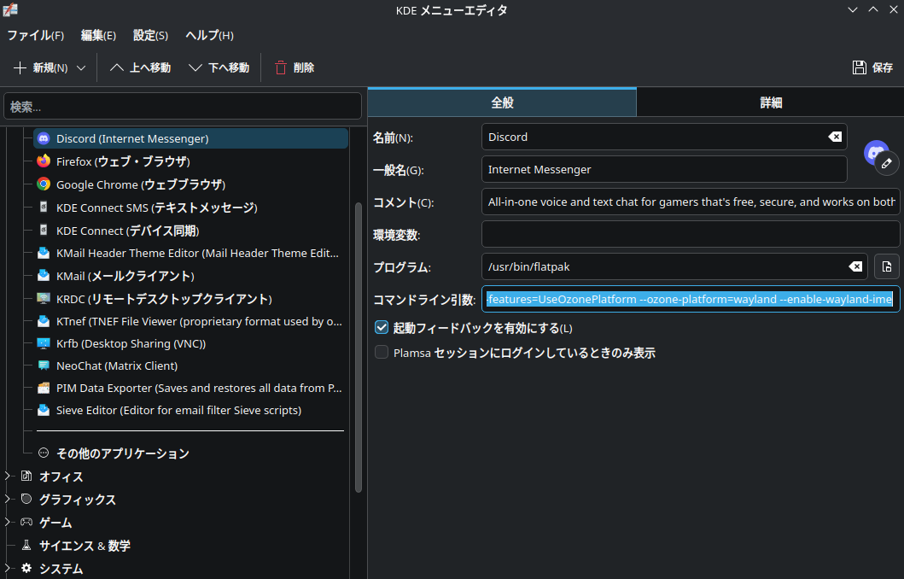

Windows11に飽きてきたので、Fedora Linux 44の[KDE Plasma Edition](https://fedoraproject.org/kde/)に乗り換えた。
ローマ字入力と半角英字入力の切り替えを快適に行うための設定が結構ややこしかったので、備忘録を残してみる。

## やりたいこと
- 使用するキーボードはANSI配列(US 87キー)のTKLタイプ。
- KDE Plasma Desktopにおいて、ローマ字入力と英数字入力を切り替えられるようにしたい。
- 全角半角切り替えのショートカットをMicrosoft IMEのデフォルトキーマップである「Alt+`」に設定したい。

## 事前準備
Geminiに聞くと、KDE Plasmaで日本語を入力するためには、[Input Method Framework](https://wiki.archlinux.org/title/Input_method)である「Fcitx5」か、\
日本語入力エンジンである「Mozc」をシステムにインストールしておく必要があるとのこと。
MozcはGNOME時代に使ったことがあったが、Fcitx5は意識したことはなかった。

調査したところ、現在のKDE Plasma（Wayland環境）においては、KDEとの親和性が高い「Fcitx5」と「Mozc」の組み合わせがよく推奨されている。\
[Using Fcitx 5 on Wayland - Fcitx](https://fcitx-im.org/wiki/Using_Fcitx_5_on_Wayland)\
[Fcitx5 - ArchWiki](https://wiki.archlinux.org/title/Fcitx5)

(Fedora 44 KDE Edition)では初期状態で「IBus Wayland」がデフォルトでシステムに組み込まれており、Fcitx5自体は未インストールであった。\
なので、とりあえずMozcを入れる方向で決定した。

## IBus-Mozcのインストール
以下のコマンドを実行した。
```bash
sudo dnf install ibus-mozc langpacks-ja
```
## GUIでの設定と発生した問題
次にGUIツールである `ibus-setup` を起動し、入力メソッドにMozcの日本語入力と英数字入力を設定。\
「一般」タブにある「キーボードショートカット」の「次の入力メソッド」という項目の横にあるボタンを押し、目的のショートカットである Alt+' を入力した。画面上では正しく Alt+' と認識され、設定が保存されたように見えた。
しかし、一向に Alt+' での入力切り替えが機能しなかった。\
実際には、KDE Plasmaの標準である `Super+Space` でしか入力の切り替えが行えないという現象に直面した。

## 解決策: gsettingsによる設定の直接上書き
設定データベースである `gsettings` コマンドを用いて、正しいキーシンボルを直接書き込むアプローチをとった。
ターミナルを開き、以下のコマンドを実行して設定を上書きする。

```bash
gsettings set org.freedesktop.ibus.general.hotkey triggers "['<Alt>grave']"
```

このコマンドにより、生のバッククォート文字ではなく、正しいキーシンボル名である `grave` を用いた配列としてホットキーが登録される。
書き込みが完了した後、変更を認識させるため、以下のコマンドでIBusデーモンを再起動した。

```bash
ibus restart
```

この手順を踏むことで、意図した通り Alt+`の組み合わせによって、スムーズに日本語入力の切り替えができるようになった。

## 【おまけ】Wayland環境のDiscordなどで日本語入力ができない場合の対処法
日本語入力の切り替えはスムーズにできるようになったんだけど、

設定を完了した後、Discord(やSlack、VS Code)といった「Electron（Chromium）製」のアプリケーションをWayland上で起動すると、IBusによる日本語入力が正常に受け付けられない問題に遭遇することがある。

これは、ChromiumのWayland対応とIMEサポートが標準で有効になっていないことが原因らしい。
これらを強制的にWaylandネイティブで動作させ、かつIMEプロトコルを有効にするためには、アプリ起動時に以下のフラグを付与して起動する必要がある。

KDEメニューエディタから、環境変数を以下の値にする。

```bash
run --branch=stable --arch=x86_64 --command=com.discordapp.Discord --file-forwarding com.discordapp.Discord @@u %U @@ --enable-features=UseOzonePlatform --ozone-platform=wayland --enable-wayland-ime
```



そうすることで、Discordでも問題なく日本語の入力を行うことができるようになった。

多分もうちょっと色々やったんだけど、とりあえず文章としてここまで残しておく。